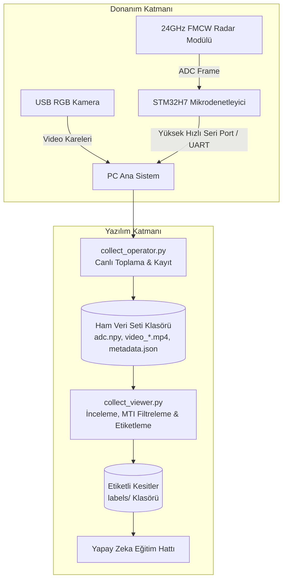

<div align="center">

# ⚡ FALLOWER — Radar Data Collection & Annotation Suite

**Yüksek Hassasiyetli FMCW Radar & Video Senkron Veri Toplama, Görselleştirme ve Aralık Etiketleme Platformu**

[](https://www.python.org/)
[]()
[]()
[]()
[]()
[]()

</div>

---

## 📖 Genel Bakış (Overview)

**FALLOWER Data Suite**, 24GHz FMCW Radar ve senkronize RGB Kamera donanımlarından milisaniye seviyesinde hassas zaman damgalı (timestamped) ham ADC verisi toplamak, bu verileri görselleştirmek, analiz etmek ve derin öğrenme modelleri (Düşme Tespiti / Aktivite Tanıma) için kırpıp etiketlemek üzere tasarlanmış uçtan uca profesyonel bir veri mühendisliği aracıdır.

---

## 🌟 Temel Yetenekler & Özellikler

### 1. 📡 Veri Toplama Stüdyosu (`collect_operator.py`)
- **ADC Master / Kamera Slave Mimarisi:** Radar donanımından gelen her ham ADC frame'i referans alınarak tam senkronize kamera karesi kaydedilir.
- **Canlı Radar Görselleştirme:** Ham ADC Dalga Formu (Time-Domain Waveform) ve FFT Spektrum analizi (Frequency-Domain).
- **Dinamik Radar Register Kontrolü:** 59 donanım register'ını (Menzil, Kazanç, İntegrasyon, Çözünürlük vb.) canlı olarak yapılandırma imkanı.
- **Düşük CPU / Yüksek FPS:** Tkinter ve OpenCV tabanlı optimize edilmiş hafif ve akıcı render döngüsü.

### 2. 🏷️ Veri İnceleme & Aralık Etiketleme Stüdyosu (`collect_viewer.py`)
- **Flicker-Free (Titremesiz) Çizim Motoru:** Beyaz/Aydınlık modern tema, interaktif crosshair ve koordinat tooltip'i.
- **Gelişmiş Sinyal Filtreleme:**
  - 📈 **Ham ADC:** Ham zaman bölgesi radar genlik sinyalleri.
  - 📊 **3-Pulse MTI Filtresi (Double Canceller):** $y[n] = x[n] - 2x[n-1] + x[n-2]$ ile statik yansımaları yok etme.
  - 🌊 **IIR / Üstel Arka Plan Temizleme:** $b_k[n] = (1-\alpha) b_{k-1}[n] + \alpha x_k[n]$ dinamik zemin bastırma.
- **Hızlı Etiketleme Butonları:** Tek tıklama ile `fall`, `walk`, `getup`, `getupgr`, `stillnoact`, `other` etiketlerini atama.
- **Zaman Çizelgesi & Dilimleme:** Çift noktalı aralık belirleme, otomatik video ve ADC kırpma, model pencere boyutu (`model_input_size`) ve `stride` parametreleriyle otomatik veri çoğaltma (Augmentation).

### 3. 🚀 Sistem Başlatıcı & Model Yöneticisi (`collect_main.py`)
- STM32H7 mikrodenetleyici seri port haberleşmesi ve sistem orkestrasyonu.
- Donanıma doğrudan model yükleme (Fire Hose transfer) ve gerçek zamanlı ONNX çıkarımı (Inference).

---

## 🏗️ Mimari Yapı (Architecture)



---

## 📂 Proje Klasör Yapısı

```
fallower-data-collector/
├── core/                   # Çekirdek yapılandırma, EventBus ve loglayıcı
│   ├── config.py
│   ├── enums.py
│   ├── event_bus.py
│   └── logger.py
├── interfaces/             # Donanım seri port haberleşme sürücüsü
│   └── serial_interface.py
├── processing/             # Veri ön işleme ve ONNX model kestirimi
│   ├── data_processor.py
│   └── model_predictor.py
├── storage/                # Veri saklama ve dosya yöneticisi
│   └── data_storage.py
├── system/                 # Ana sistem yaşam döngüsü orkestrasyonu
│   └── fallower_system.py
├── models/                 # Eğitilmiş ONNX düşme tespit modelleri
├── visualization/          # NPZ ve veri dönüşüm araçları
├── collect_main.py         # Ana terminal ve sistem başlatıcı
├── collect_operator.py     # Canlı Veri Toplama Arayüzü
├── collect_viewer.py       # Veri Görüntüleme & Etiketleme Arayüzü
├── requirements.txt        # Python kütüphane bağımlılıkları
├── .gitignore              # Git takip dışı dosyalar listesi
├── run_operator.bat        # Toplama arayüzünü tek tıkla başlatıcı
├── run_viewer.bat          # Görüntüleyiciyi tek tıkla başlatıcı
└── README.md               # Proje belgelendirmesi
```

---

## ⚡ Kurulum (Installation)

### 1. Gereksinimler
- **İşletim Sistemi:** Windows 10/11, Linux veya macOS
- **Python:** 3.8 veya üzeri

### 2. Ortamın Hazırlanması
```bash
# Depoyu klonlayın
git clone <REPO_URL>
cd fallower-data-collector

# Sanal ortam oluşturun (Önerilen)
python -m venv venv
# Windows için etkinleştirme:
venv\Scripts\activate
# Linux/macOS için:
source venv/bin/activate

# Gerekli bağımlılıkları yükleyin
pip install -r requirements.txt
```

---

## 🚀 Kullanım (Quick Start)

### 1. Canlı Radar Verisi Toplama
Radar ve kamerayı bağladıktan sonra veri toplama arayüzünü açın:
```bash
python collect_operator.py
```
*veya Windows üzerinde `run_operator.bat` dosyasına çift tıklayın.*

### 2. Kayıtları İnceleme & Etiketleme
Toplanan oturumları incelemek, MTI filtreli dalga formlarını izlemek ve model için aralık kesitleri üretmek için:
```bash
python collect_viewer.py
```
*veya Windows üzerinde `run_viewer.bat` dosyasına çift tıklayın.*

---

## ⌨️ Klavye Kısayolları (Keyboard Shortcuts)

| Kısayol | İşlev |
|:---|:---|
| **`Space` (Boşluk)** | Sinyal ve Video Senkron Oynat / Duraklat |
| **`←` / `→`** | 1 Frame Geri / İleri Git |
| **`Shift + ←` / `Shift + →`** | 10 Frame Geri / İleri Hızlı Sar |
| **`Home` / `End`** | Kaydın Başına / Sonuna Git |
| **`I`** | Başlangıç Frame'ini İşaretle (Mark In) |
| **`O`** | Bitiş Frame'ini İşaretle (Mark Out) |
| **`S`** | İşaretli Aralığı Kırp ve Etiket Olarak Kaydet |
| **`Esc` / `C`** | İşaretli Aralıkları Temizle |

---

## 📊 Üretilen Veri Formatı (Data Specification)

Her kayıt oturumu bağımsız bir klasör altında şu dosyalarla saklanır:

| Dosya Adı | Format | Açıklama |
|:---|:---|:---|
| **`adc.npy`** | NumPy Array | Her satırı bir radar tarama çerçevesi olan ham 16-bit ADC verisi |
| **`adc_meta.npy`** | NumPy `[N, 2]` | `[stm32_rel_ts, pc_rel_ts]` donanım ve PC zaman damgaları |
| **`camera_timestamps.npy`** | NumPy `[M]` | Her video karesinin kaydedildiği milisaniye zaman damgası |
| **`video_*.mp4`** | H.264 / MJPG | Radar ADC periyoduyla senkronize kaydedilen kamera videosu |
| **`metadata.json`** | JSON | Radar register ayarları, FPS, menzil ve oturum notları |

---

## 🛠️ Bağımsız EXE Olarak Derleme

`collect_viewer.py` veya `collect_operator.py` dosyalarını Python kurulu olmayan bilgisayarlarda çalıştırmak için `.exe` haline getirebilirsiniz:

```bash
pyinstaller --clean --onefile --name "FALLOWER_Viewer" collect_viewer.py
```

---

## 📄 Lisans

Bu proje özel araştırma ve geliştirme projesi kapsamında oluşturulmuştur. Tüm hakları saklıdır.
