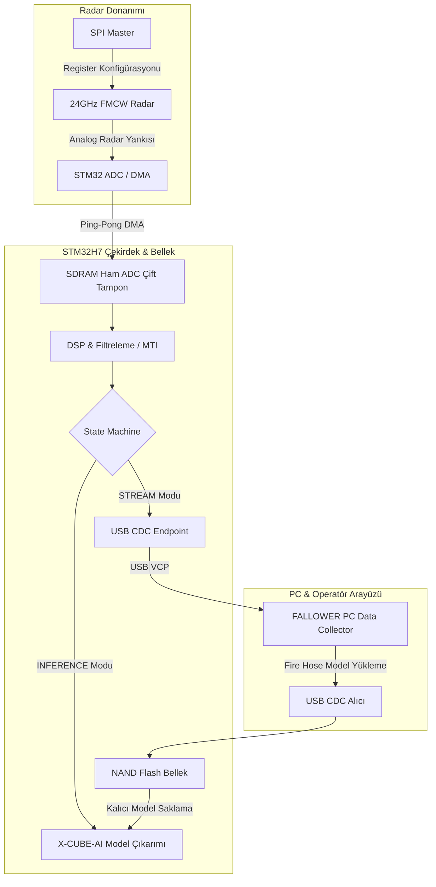

<div align="center">

# ⚡ FALLOWER — STM32H7 Firmware (Radar & Edge AI Core)

**24GHz FMCW Radar Sinyal İşleme, Gerçek Zamanlı USB Akışı ve Gömülü Derin Öğrenme (Edge AI) Bellenimi**

[](https://www.st.com/en/microcontrollers-microprocessors/stm32h743zi.html)
[](https://www.freertos.org/)
[](https://www.st.com/en/embedded-software/x-cube-ai.html)
[]()
[]()

</div>

---

## 📖 Genel Bakış (Overview)

**FALLOWER STM32H7**, yaşlı ve risk altındaki bireylerde düşme tespiti (Fall Detection) ve insan aktivitesi tanıma (HAR) amacıyla geliştirilmiş 24GHz FMCW Radar sensörünü kontrol eden, yüksek hızlı ADC verilerini toplayıp işleyen ve cihaz üzerinde (on-device) sinir ağı çıkarımı gerçekleştiren yüksek performanslı gömülü sistem bellenimidir.

Sistem, **ARM Cortex-M7 (480 MHz)** çekirdeğinin DSP ve FPU yeteneklerini kullanarak milisaniye hassasiyetinde radar örneklemesi yapar, çift tamponlu (Double-Buffering) DMA mimarisiyle verileri kayıpsız bir şekilde USB CDC üzerinden PC'ye aktarır veya yerel X-CUBE-AI modeline besler.

---

## 🌟 Temel Özellikler & Yetenekler

### 1. 📡 Donanım Radar Sürücüsü (`radar_driver.cpp` / `radarHandler.cpp`)
- **59 Register Donanım Haritası (0x00 - 0x3A):** SPI üzerinden dinamik menzil, kazanç (PGA/VGA), chirp süresi, integrasyon ve çözünürlük yapılandırması.
- **Yüksek Hızlı ADC & DMA:** Kesintisiz veri aktarımı için dairesel/çift tamponlu (Ping-Pong Buffer) DMA okumaları.
- **STM32 Donanım Zaman Damgası:** Her radar frame'i için donanım seviyesinde mikrosaniye/milisaniye zaman damgaları.

### 2. 🎛️ Modüler Durum Makinesi (State Machine Architecture)
Uygulama yaşam döngüsü nesne yönelimli ve sağlam bir durum makinesi ile yönetilir:
- **`INIT`:** Donanım çevre birimleri (Clock, SDRAM, SPI, ADC, USB, NAND) başlatılır.
- **`CALIBRATE`:** Radar temel gürültü ve arka plan kalibrasyonu gerçekleştirilir.
- **`READY` / `IDLE`:** Sistem komut bekler, düşük güç moduna geçebilir.
- **`STREAM`:** Ham ADC çerçeveleri milisaniye bazında PC'deki `fallower-data-collector` arayüzüne USB CDC ile canlı aktarılır.
- **`REALTIME_INFERENCE`:** X-CUBE-AI ve CMSIS-NN optimizasyonlu derin öğrenme modeli (MobileNetV3) cihaz üzerinde gerçek zamanlı koşturulur.
- **`LOADING_DATA` / `MODEL_READY`:** PC'den gönderilen yeni ONNX/TFLite model ikilileri (Fire Hose protokolü) NAND Flash ve SDRAM'e dinamik olarak yazılır ve doğrulanır (CRC32).

### 3. ⚡ USB İletişim & Fire Hose Protokolü (`UsbCommunication.cpp`)
- **USB CDC (Virtual COM Port):** Yüksek bant genişlikli ikili veri akışı.
- **STM32 Donanım CRC32 Denetimi:** Model yükleme sırasında paket bütünlüğünü garanti eden donanım CRC32 motoru.

---

## 🏗️ Sistem Mimarisi & Veri Akışı



---

## 📂 Dizin Yapısı

```
fallower-stm32h7/
├── Core/
│   ├── Inc/                    # Başlık dosyaları (.h / .hpp)
│   ├── Src/                    # C/C++ Kaynak kodları
│   │   ├── state/              # Durum Makinesi sınıfları (Init, Stream, Inference vb.)
│   │   ├── UsbCommunication.cpp# USB CDC protokolü ve veri akış motoru
│   │   ├── radar_driver.cpp    # 24GHz Radar SPI/Register sürücüsü
│   │   ├── radarHandler.cpp    # ADC örnekleme ve zamanlama yöneticisi
│   │   ├── sdramInitialization.cpp # Harici SDRAM bellek kontrolcüsü
│   │   ├── nand_model_storage.c# Model saklama ve NAND Flash sürücüsü
│   │   ├── ai_monitoring.cpp   # Yapay zeka çıkarım izleme ve telemetri
│   │   └── main.cpp            # Ana başlatıcı ve FreeRTOS görevleri
│   └── Startup/                # STM32H743ZI Başlangıç Assembly kodu
├── Drivers/                    # STM32H7 HAL & CMSIS Sürücüleri
├── Middlewares/                # FreeRTOS & ST USB Aygıt Kütüphanesi
├── USB_DEVICE/                 # USB CDC Aygıt Sınıfı Yapılandırması
├── X-CUBE-AI/                  # ST Edge AI Çalışma Zamanı & Model Kodları
├── STM32H743ZITX_FLASH.ld      # Flash Bellek Linker Script'i
├── STM32H743ZITX_RAM.ld        # RAM Linker Script'i
├── STM32_Git.ioc               # STM32CubeMX Donanım Pinout ve Clock Yapılandırması
└── README.md                   # Proje belgelendirmesi
```

---

## ⚙️ Donanım & Çevre Birimleri Yapılandırması (Pinout)

| Çevre Birimi | İşlev | Açıklama |
|:---|:---|:---|
| **SPI1 / SPI2** | Radar Kontrolü | 59 adet donanım register'ını okuma/yazma |
| **ADC1 / ADC2 + DMA** | Radar ADC Okuma | Yüksek hızlı örnekleme, mikrosaniye zaman damgası |
| **FMC (SDRAM)** | Harici Bellek | 32MB / 64MB SDRAM (AI Modeli & ADC Tamponları için) |
| **FMC (NAND)** | Kalıcı Depolama | ONNX/TFLite model ağırlıklarını kalıcı saklama |
| **USB OTG FS/HS** | PC İletişimi | USB CDC Sanal Seri Port (Ham veri akışı & model transferi) |
| **TIM2 / TIM5** | Donanım Zamanlayıcı | 32-bit mikrosaniye hassasiyetli zaman damgası |

---

## 🛠️ Derleme ve Yükleme (Build & Flash)

### 1. STM32CubeIDE ile:
1. `STM32CubeIDE` programını açın.
2. `File -> Open Projects from File System...` seçeneğiyle `fallower-stm32h7` klasörünü seçin.
3. `Project -> Build Project` (Ctrl+B) ile projeyi derleyin.
4. ST-Link V2 / V3 programlayıcıyı karta bağlayın ve `Run -> Debug` veya `Run` seçeneği ile karta yükleyin.

### 2. ARM GCC & Make ile:
```bash
# Debug derlemesi
make -j8

# ST-Link CLI / OpenOCD ile yükleme
openocd -f interface/stlink.cfg -f target/stm32h7x.cfg -c "program Debug/fallower-stm32h7.elf verify reset exit"
```

---

## 🔗 İlgili Depo

- **PC Veri Toplama & Etiketleme Yazılımı:** [fallower-data-collector](https://github.com/gunduzyunusemre/fallower-data-collector)

---

## 📄 Lisans

Bu proje özel araştırma ve geliştirme projesi kapsamında oluşturulmuştur. Tüm hakları saklıdır.
